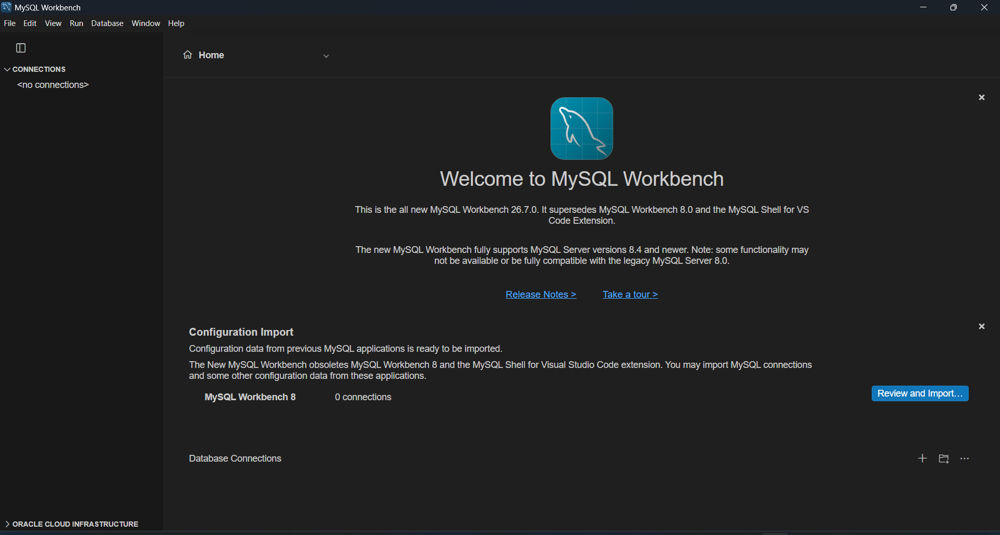
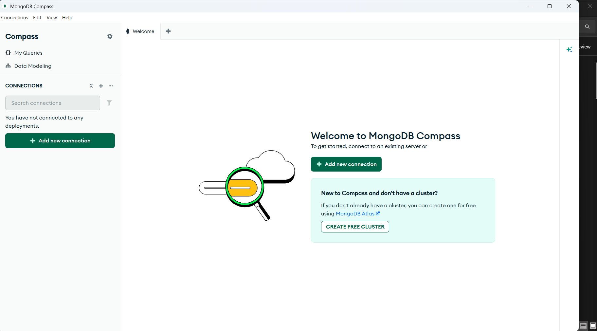
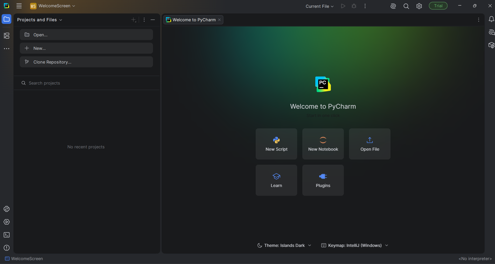
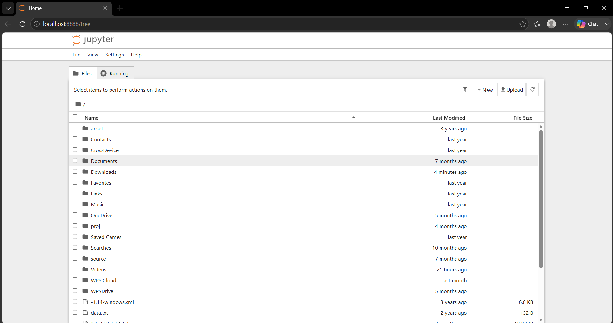
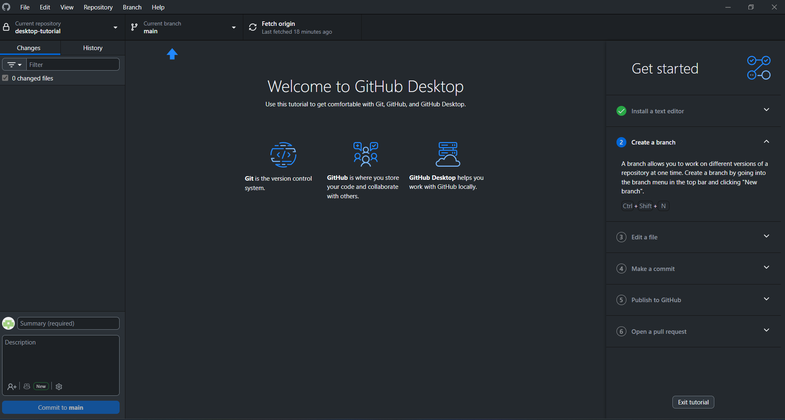

#software installtion


1) xampp server:

    ** where to setup **

    ```https://www.apachefriends.org/download_success.html```

....

    ***xampp full form**

    **x** : support cross plateform

    **A** : apache is a server

    **M** : mysql (database)

    **P** : perl(procedural based language)

    **P** : php

2) mysqlworkbench8.0:

    ** where to setup **

    ```https://dev.mysql.com/downloads/file/?id=559064```

    .....

    

3) download and install python:

    ** wheere to setup **

    ```https://www.python.org/downloads/```

    .....

    ** set up python **
    step 1: open cmd
    step 2: python
    step 3: 3.14.2


4) mongoDB compass

    ** where to setup**
    ```https://www.mongodb.com/try/download/compass```

    .....
    
    

5) PyCharm
    ** where to setup **

    ```https://www.jetbrains.com/pycharm/download/download-thanks.html?platform=windowsARM64 ```

    ....

    

6) visual studio cod IDE
7) jupyter notebook

** where to setup **

```https://jupyter.org/install```

......

 


8) excel

9) poweBI

10) numpy of python

    cmd : pip install numpy 
    
    cmd : pip show numpy

11) seaborn for python

    cmd : pip install seborn

    cmd : cmd : pip show seabron


12) pandas for pytho

    cmd : pip install pandas

    cmd : pip show pandas

    
13) matplotlib for python

    cmd : pip install matplotlib

    cmd : pip show matplotlib

14) github set-up:
    1. githhub is product of microsoft
    2. github create a repository systems
    3. create repository we uplode our data in repository
    4. after we shareed public | private our data

# create a acoount
```
https://github.com/
``` 



# github commands to uplode files
# download git software gitbash 
1. get init 
2. git add .
3. git commit -m "12-9-2026 all data uplode"
4. git branch -m main or master 
5. git remote add origin https://github.com/vaghelasmit70-prog/data_analytics_data_science_11am_tts.git 
6. git pus -u origin master 
