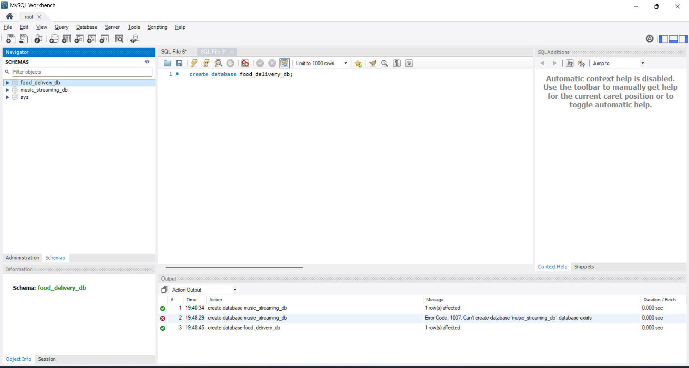

# Tasks

1. Install MySQL Community Server on your computer and take a screenshot of the MySQL installer completion window.

2. Open MySQL Workbench or DB Browser, connect to your local MySQL server, and create a new database called music_streaming_db.

3. Write the SQL command to create a new database named food_delivery_db and execute it in your SQL Workbench or DB Browser.<br><br><em><strong>Hint:</strong> Use the CREATE DATABASE statement.</em>

4. List 3 differences between MySQL and PostgreSQL in terms of features or use cases, and give one example of a popular app or company that uses each.

**solution**

## 1: Complete Setup & Select All Records from Restaurants Table

MySQL Community Server was successfully installed on the computer.


MySQL Community Server 8.0.46 was successfully installed.


-----

### 2. SQL Query

## Create Database

I created a new database named `music_streaming_db` using MySQL Workbench.

### SQL Query

```sql
CREATE DATABASE music_streaming_db;
```
## Create Database

I created a new database named `music_streaming_db` using MySQL Workbench.
 


------

## 3. Create Food Delivery Database

I created a new database named `food_delivery_db` using MySQL Workbench.

### SQL Command

```sql
CREATE DATABASE food_delivery_db;
```



-----

## 4. Differences Between MySQL and PostgreSQL

# Assignment: Differences Between MySQL and PostgreSQL

---

## 📌 3 Key Differences Between MySQL and PostgreSQL

| Feature / Use Case | **MySQL** | **PostgreSQL** |
| :--- | :--- | :--- |
| **1. Database Type & Extensibility** | Pure Relational Database Management System (RDBMS). It has simpler extensibility and focuses on standard relational structures. | Object-Relational Database Management System (ORDBMS). Highly extensible; supports advanced data types (e.g., Arrays, geometric types, UUID, full JSONB with indexing) and custom user-defined types/functions. |
| **2. Workload & Query Complexity** | Best suited for **read-heavy**, straightforward OLTP (Online Transaction Processing) operations with simple schemas. Often preferred for standard web apps, CMS, and e-commerce. | Best suited for **complex queries**, heavy analytical operations, concurrent writes, and large-scale data processing where strict SQL standards and advanced indexing (GIN, GiST) are required. |
| **3. SQL Standards & Concurrency (MVCC)** | Focuses on speed and simplicity; supports core SQL standards. Concurrency control uses InnoDB with table/row-level locking and MVCC, which excels in read-intensive environments. | Stricter adherence to ANSI-SQL standards. Uses advanced Multi-Version Concurrency Control (MVCC) without read-locks, allowing high concurrency and better handling of simultaneous read/write operations. |

---

## 🏢 Popular Companies / Apps Using Each

### 🔹 **MySQL Example:**
* **Meta (Facebook):** Uses heavily scaled and customized MySQL architectures to handle massive volumes of web traffic, user profiles, and social graph data for read-intensive operations.

### 🔹 **PostgreSQL Example:**
* **Instagram / Spotify:** Instagram relies heavily on PostgreSQL as its primary database engine to manage complex relations, custom indexing, and high-concurrency transactional feeds reliably.

---

1. **Licensing:** MySQL is available under the GPL, with commercial licensing also offered by Oracle. PostgreSQL uses a permissive, open-source license. This can affect how organizations distribute or embed the database.

2. **Features and extensibility:** PostgreSQL offers rich support for custom data types and extensions, as well as `JSONB` with indexing options. MySQL also supports JSON, but PostgreSQL is often chosen when applications need more advanced data modeling or database extensions.

3. **Storage engines:** MySQL supports multiple storage engines, such as InnoDB, letting users select an engine for different needs. PostgreSQL uses a more integrated database engine, providing a consistent feature set across tables.

**Examples:** Facebook is a well-known user of MySQL, and Instagram is a well-known user of PostgreSQL.

---

