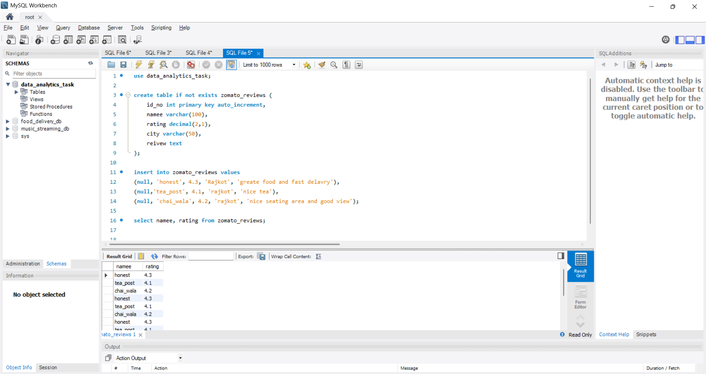
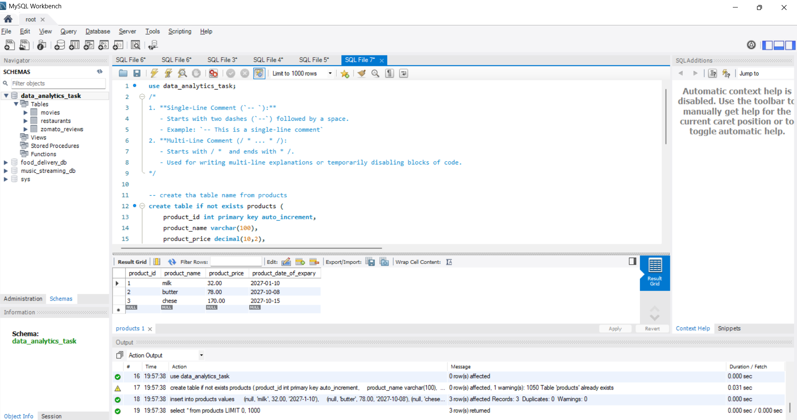

# Task

1. Open your SQL editor and run a query to select all columns from a table named restaurants using SELECT * FROM restaurants;.

2. Write an SQL query to display only the name and rating columns from the table zomato_reviews.

3. Write an SQL query to select the movie_name and release_year columns from a table called movies, but rename movie_name as 'Title' and release_year as 'Year Released' in the output using the AS keyword.

4. In a table called products, write an SQL query that selects all columns and add a comment in your SQL code explaining what the query does.<br><br><em><strong>Hint:</strong> Use -- to write a single-line comment above your query.</em>

**soultion**

## 1: Complete Setup & Select All Records from Restaurants Table

```sql
create database if not exists data_analytics_task;
use data_analytics_task;

create table if not exists restaurants(
	id_no int primary key auto_increment,
    namee varchar(100),
    price varchar(50),
    rating decimal(2,1),
    city varchar(50)
 );
 
 select * from restaurants;
 ```

 

---

## 2: Display Specific Columns (Name & Rating) from Zomato Review

```sql
use data_analytics_task;

create table if not exists zomato_reviews (
	id_no int primary key auto_increment,
    namee varchar(100),
    rating decimal(2,1),
    city varchar(50),
    reivew text
);

insert into zomato_reviews values 
(null, 'honest', 4.3, 'Rajkot', 'greate food and fast delavry'),
(null,'tea_post', 4.1, 'rajkot', 'nice tea'),
(null, 'chai_wala', 4.2, 'rajkot', 'nice seating area and good view');

select namee, rating from zomato_reviews;


```



---

## 3. Column Aliasing using `AS` Keyword (Movies Table)

```sql
create table if not exists movies (
	movie_id int primary key auto_increment,
    movie_name varchar(100),
    release_year int,
    rating decimal (2,1)
);

insert into movies values 
(null, 'wolf', 2009, 4.3),
(null, 'war', 2025, 4.2),
(null, 'money', 2024, 4.5);

select movie_name  as title, release_year as 'year release' from movies;

select * from movies;
```


---

## 4. Selecting All Columns with SQL Comments (Products Table)

##  Concept: SQL Comments

Comments in SQL are non-executable statements used to explain the purpose of the code and improve readability. The SQL engine ignores comments during execution.

1. **Single-Line Comment (`-- `):**
   - Starts with two dashes (`--`) followed by a space.
   - Example: `-- This is a single-line comment`

2. **Multi-Line Comment (`/* ... */`):**
   - Starts with `/*` and ends with `*/`.
   - Used for writing multi-line explanations or temporarily disabling blocks of code.

---

```sql
use data_analytics_task;
/*
1. **Single-Line Comment (`-- `):**
   - Starts with two dashes (`--`) followed by a space.
   - Example: `-- This is a single-line comment`
2. **Multi-Line Comment (/ * ... * /):
   - Starts with / *  and ends with * /.
   - Used for writing multi-line explanations or temporarily disabling blocks of code.
*/

-- create tha table name from products
create table if not exists products (
	product_id int primary key auto_increment,							
    product_name varchar(100),
    product_price decimal(10,2),
    product_date_of_expary date
    );
  -- insert the data in products values
    insert into products values 
    (null, 'milk', 32.00, '2027-1-10'),
    (null, 'butter', 78.00, '2027-10-08'),
	(null, 'chese', 170.00, '2027-10-15');
    
-- query with comment 
-- this query fetch the all columns from the products table 

select * from products; 
```   


---


---


